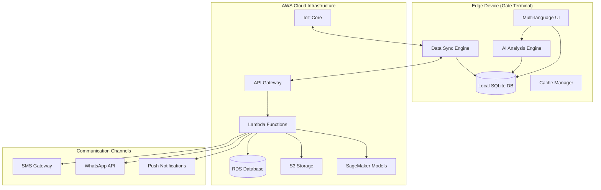

# SurakshaOS Design Document

## Overview

SurakshaOS is an AI-powered, offline-first community security system designed for Indian housing societies, hostels, hospitals, and rural community gates. The system combines intelligent visitor behavior analysis with robust offline capabilities, privacy-first principles, and multi-language support to provide comprehensive security management.

The architecture follows an offline-first approach where local data serves as the source of truth, with cloud synchronization happening opportunistically. The AI engine performs real-time behavioral analysis using locally stored models, ensuring continuous operation during network outages while maintaining privacy through minimal data collection.

## Architecture

### High-Level Architecture



### Offline-First Architecture Pattern

The system implements a local-first data management approach where:
- **Local SQLite database** serves as the primary data source
- **Background synchronization** occurs when connectivity is available
- **Conflict resolution** handles data inconsistencies during sync
- **Progressive enhancement** enables additional features when online

### Edge Computing Components

- **Local AI Processing**: Machine learning inference runs entirely on the edge device using optimized models
- **Data Caching**: Essential data cached locally for instant access
- **Queue Management**: Offline actions queued for later synchronization
- **State Management**: Application state persisted locally across sessions

## Components and Interfaces

### Core Components

#### 1. Visitor Management Service
```typescript
interface VisitorManagementService {
  registerVisitor(visitorData: VisitorData): Promise<VisitorEntry>
  approveVisitor(visitorId: string, residentId: string): Promise<ApprovalResult>
  denyVisitor(visitorId: string, reason: string): Promise<DenialResult>
  getVisitorHistory(filters: VisitorFilters): Promise<VisitorEntry[]>
}

interface VisitorData {
  name: string
  phoneNumber: string
  purpose: string
  intendedResident: string
  vehicleNumber?: string
  expectedDuration?: number
}
```

#### 2. AI Analysis Engine
```typescript
interface AIAnalysisEngine {
  analyzeVisitorPattern(visitorData: VisitorData, history: VisitorEntry[]): Promise<RiskAssessment>
  detectAnomalies(patterns: VisitorPattern[]): Promise<AnomalyAlert[]>
  calculateRiskScore(factors: RiskFactors): Promise<RiskScore>
  explainDecision(riskScore: RiskScore): Promise<ExplanationResult>
}

interface RiskAssessment {
  riskScore: number // 0-100
  riskLevel: 'LOW' | 'MEDIUM' | 'HIGH' | 'CRITICAL'
  contributingFactors: RiskFactor[]
  recommendations: string[]
}
```

#### 3. Offline Data Manager
```typescript
interface OfflineDataManager {
  storeLocally<T>(collection: string, data: T): Promise<void>
  retrieveLocal<T>(collection: string, query: Query): Promise<T[]>
  queueForSync(operation: SyncOperation): Promise<void>
  syncWithCloud(): Promise<SyncResult>
  resolveConflicts(conflicts: DataConflict[]): Promise<Resolution[]>
}
```

#### 4. Multi-Language Interface
```typescript
interface LanguageService {
  setLanguage(languageCode: string): Promise<void>
  translate(key: string, params?: object): string
  getSupportedLanguages(): Language[]
  enableVoiceInput(languageCode: string): Promise<VoiceInputHandler>
}
```

### Integration Interfaces

#### AWS IoT Greengrass Integration
```typescript
interface GreengrassConnector {
  deployMLModel(modelPath: string): Promise<void>
  performInference(inputData: any): Promise<InferenceResult>
  syncDeviceState(): Promise<void>
  handleCloudMessages(): Promise<void>
}
```

#### Communication Gateway
```typescript
interface CommunicationGateway {
  sendSMS(phoneNumber: string, message: string): Promise<void>
  sendWhatsAppMessage(phoneNumber: string, template: string, params: object): Promise<void>
  sendPushNotification(deviceId: string, notification: Notification): Promise<void>
}
```

## Data Models

### Core Data Entities

#### Visitor Entry
```typescript
interface VisitorEntry {
  id: string
  timestamp: Date
  visitorInfo: {
    name: string
    phoneNumber: string
    purpose: string
    vehicleNumber?: string
  }
  residentInfo: {
    residentId: string
    unitNumber: string
    approvalStatus: 'PENDING' | 'APPROVED' | 'DENIED'
    approvalTimestamp?: Date
  }
  securityInfo: {
    guardId: string
    entryTime?: Date
    exitTime?: Date
    riskScore: number
    flagged: boolean
  }
  metadata: {
    createdAt: Date
    updatedAt: Date
    syncStatus: 'LOCAL' | 'SYNCED' | 'CONFLICT'
  }
}
```

#### Domestic Staff Profile
```typescript
interface DomesticStaffProfile {
  id: string
  personalInfo: {
    name: string
    phoneNumber: string
    address: string
    emergencyContact: string
  }
  workInfo: {
    serviceType: 'MAID' | 'COOK' | 'DRIVER' | 'GARDENER' | 'OTHER'
    authorizedUnits: string[]
    workSchedule: WorkSchedule[]
    startDate: Date
    endDate?: Date
  }
  accessInfo: {
    accessCode: string
    biometricId?: string
    lastEntry?: Date
    attendanceRecord: AttendanceEntry[]
  }
}
```

#### Risk Assessment
```typescript
interface RiskAssessment {
  visitorId: string
  assessmentTime: Date
  riskScore: number
  riskLevel: RiskLevel
  factors: {
    frequencyScore: number
    timingScore: number
    behaviorScore: number
    historicalScore: number
  }
  anomalies: AnomalyDetection[]
  explanation: {
    primaryReasons: string[]
    recommendations: string[]
    confidence: number
  }
}
```

### Local Database Schema

#### SQLite Tables Structure
```sql
-- Visitors table for local storage
CREATE TABLE visitors (
    id TEXT PRIMARY KEY,
    name TEXT NOT NULL,
    phone_number TEXT NOT NULL,
    purpose TEXT NOT NULL,
    intended_resident TEXT NOT NULL,
    vehicle_number TEXT,
    entry_time DATETIME,
    exit_time DATETIME,
    approval_status TEXT DEFAULT 'PENDING',
    risk_score REAL DEFAULT 0,
    flagged BOOLEAN DEFAULT FALSE,
    sync_status TEXT DEFAULT 'LOCAL',
    created_at DATETIME DEFAULT CURRENT_TIMESTAMP,
    updated_at DATETIME DEFAULT CURRENT_TIMESTAMP
);

-- Domestic staff table
CREATE TABLE domestic_staff (
    id TEXT PRIMARY KEY,
    name TEXT NOT NULL,
    phone_number TEXT NOT NULL,
    service_type TEXT NOT NULL,
    authorized_units TEXT, -- JSON array
    work_schedule TEXT, -- JSON object
    access_code TEXT UNIQUE,
    active BOOLEAN DEFAULT TRUE,
    created_at DATETIME DEFAULT CURRENT_TIMESTAMP
);

-- Risk assessments table
CREATE TABLE risk_assessments (
    id TEXT PRIMARY KEY,
    visitor_id TEXT NOT NULL,
    risk_score REAL NOT NULL,
    risk_level TEXT NOT NULL,
    factors TEXT, -- JSON object
    anomalies TEXT, -- JSON array
    explanation TEXT, -- JSON object
    created_at DATETIME DEFAULT CURRENT_TIMESTAMP,
    FOREIGN KEY (visitor_id) REFERENCES visitors(id)
);
```

## Correctness Properties

*A property is a characteristic or behavior that should hold true across all valid executions of a system—essentially, a formal statement about what the system should do. Properties serve as the bridge between human-readable specifications and machine-verifiable correctness guarantees.*

Based on the prework analysis, here are the key correctness properties for SurakshaOS:

### Property 1: Visitor Data Integrity
*For any* visitor entry with complete required fields (name, phone, purpose, intended resident), the system should successfully store the data locally with a unique ID and valid timestamp.
**Validates: Requirements 1.1, 1.3, 1.4**

### Property 2: Input Validation Consistency
*For any* input data, the system should accept valid data and reject invalid data consistently, regardless of the input language or format.
**Validates: Requirements 1.2, 4.2**

### Property 3: Approval Workflow State Transitions
*For any* visitor approval or denial action, the system should correctly transition the visitor status and trigger appropriate notifications to relevant parties.
**Validates: Requirements 2.3, 2.4**

### Property 4: Timeout Policy Application
*For any* visitor request that exceeds the configured timeout period, the system should apply the community's default policy consistently.
**Validates: Requirements 2.5**

### Property 5: Staff Schedule Verification
*For any* registered domestic staff member, the system should automatically verify access only during their authorized schedule periods.
**Validates: Requirements 3.2, 3.5**

### Property 6: Temporary Access Management
*For any* delivery authorization, the system should generate time-limited credentials and automatically revoke them upon expiration.
**Validates: Requirements 4.3, 4.4**

### Property 7: Emergency Mode Behavior
*For any* emergency activation, the system should provide immediate access override and return to normal protocols when emergency ends.
**Validates: Requirements 5.1, 5.5**

### Property 8: Risk Score Calculation
*For any* visitor data processed by the AI engine, risk scores should be calculated based on frequency, timing, and behavioral factors, with scores triggering alerts when exceeding thresholds.
**Validates: Requirements 6.2, 6.3, 7.2**

### Property 9: AI Decision Explainability
*For any* AI-generated risk assessment or anomaly flag, the system should provide clear explanations including contributing factors and historical context.
**Validates: Requirements 6.5, 12.1, 12.2, 12.3**

### Property 10: Offline Operation Completeness
*For any* core system function, the system should operate without internet connectivity using local data and models.
**Validates: Requirements 9.1, 9.4**

### Property 11: Data Synchronization Round-Trip
*For any* data stored locally while offline, when connectivity is restored, the data should sync to cloud services and any updates should sync back without data loss.
**Validates: Requirements 9.2, 9.5**

### Property 12: Multi-Language Consistency
*For any* supported regional language, all interface elements, input capabilities, and generated reports should function consistently in that language.
**Validates: Requirements 10.1, 10.2, 10.3, 10.5**

### Property 13: Privacy-First Data Handling
*For any* personal data collection or processing, the system should operate without mandatory biometric data, store data with encryption, and provide deletion capabilities upon request.
**Validates: Requirements 8.1, 8.2, 8.4**

### Property 14: Human Override Capability
*For any* AI recommendation or decision, security guards should be able to override the decision with proper justification logging.
**Validates: Requirements 12.4, 12.5**

### Property 15: Comprehensive Data Logging
*For any* system operation (visitor entries, staff access, deliveries, emergencies, AI decisions), the system should maintain appropriate logs for audit and analysis purposes.
**Validates: Requirements 3.4, 4.5, 5.2, 5.4**

<function_calls>
<invoke name="prework">
<parameter name="featureName">suraksha-os

## Error Handling

### Offline Operation Errors
- **Network Connectivity Loss**: System continues operation using local data, queues sync operations
- **Local Storage Full**: Implements data rotation policy, alerts administrators
- **Model Loading Failures**: Falls back to rule-based analysis, logs errors for later resolution

### AI Engine Errors
- **Inference Failures**: Provides default risk scores, logs errors for model improvement
- **Data Quality Issues**: Validates input data, provides warnings for incomplete information
- **Model Drift Detection**: Monitors prediction accuracy, triggers model update requests

### Communication Failures
- **SMS/WhatsApp Delivery Failures**: Implements retry mechanisms with exponential backoff
- **Push Notification Failures**: Falls back to alternative communication channels
- **Resident Unavailability**: Applies timeout policies and default community rules

### Data Integrity Errors
- **Sync Conflicts**: Implements last-write-wins with conflict logging for manual resolution
- **Corruption Detection**: Uses checksums and validation to detect corrupted data
- **Backup Failures**: Maintains multiple backup strategies (local, cloud, periodic exports)

### Security Errors
- **Unauthorized Access Attempts**: Logs attempts, implements progressive lockout policies
- **Data Breach Detection**: Encrypts sensitive data, monitors for unusual access patterns
- **System Tampering**: Validates system integrity, alerts administrators of modifications

## Testing Strategy

### Dual Testing Approach

The testing strategy combines unit testing for specific scenarios with property-based testing for comprehensive coverage:

**Unit Tests**: Focus on specific examples, edge cases, and integration points
- Specific visitor approval/denial scenarios
- Emergency mode activation/deactivation
- Language switching functionality
- AWS service integration points
- Error condition handling

**Property-Based Tests**: Verify universal properties across all inputs using randomized data
- Minimum 100 iterations per property test
- Each test references its corresponding design document property
- Comprehensive input coverage through data generation

### Property-Based Testing Configuration

**Testing Framework**: Use Hypothesis (Python) or fast-check (TypeScript) for property-based testing
**Test Configuration**:
- Minimum 100 iterations per property test
- Custom data generators for visitor data, staff profiles, and risk assessments
- Shrinking enabled to find minimal failing examples

**Test Tagging Format**:
```python
# Feature: suraksha-os, Property 1: Visitor Data Integrity
@given(visitor_data=visitor_data_strategy())
def test_visitor_data_integrity(visitor_data):
    # Test implementation
```

### AI Model Testing

**Model Validation**:
- Cross-validation on historical community data
- A/B testing for risk score accuracy
- Bias detection across different demographic groups
- Explainability validation through human expert review

**Edge Case Testing**:
- Unusual visitor patterns (very frequent, very rare)
- Time-based anomalies (late night, holiday patterns)
- Multi-language input validation
- Offline model performance validation

### Integration Testing

**AWS Integration**:
- CloudFormation template deployment validation
- IoT Greengrass model deployment testing
- Data synchronization across edge-cloud boundary
- Auto-scaling behavior under load

**Communication Testing**:
- SMS/WhatsApp delivery confirmation
- Push notification reliability
- Multi-channel fallback mechanisms
- Regional language message formatting

### Performance Testing

**Offline Performance**:
- Local database query performance
- AI inference latency on edge devices
- UI responsiveness during heavy data entry
- Memory usage optimization validation

**Scalability Testing**:
- Multi-community deployment performance
- Concurrent user handling
- Data sync performance with large datasets
- AWS resource utilization optimization

### Security Testing

**Privacy Validation**:
- Data encryption verification
- Consent management workflow testing
- Data deletion completeness validation
- Biometric data absence verification

**Access Control Testing**:
- Role-based permission validation
- Emergency override security
- Audit trail completeness
- Unauthorized access prevention

This comprehensive testing strategy ensures SurakshaOS meets all functional requirements while maintaining high reliability, security, and performance standards across diverse deployment scenarios.